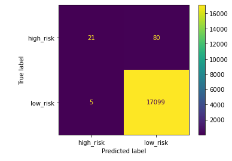

# Written Analysis

Overview of the analysis: The purpose of this analysis 

Results: Using bulleted lists describe the results of the balanced accuracy score and the precision and recall scores of all six machine learning models. Use screenshots of your outputs to support your results.

Summary: Summarize the results of the machine learning models and include a recommendation on the model to use, if any. If you do not recommend any of the models, justify your reasoning.
